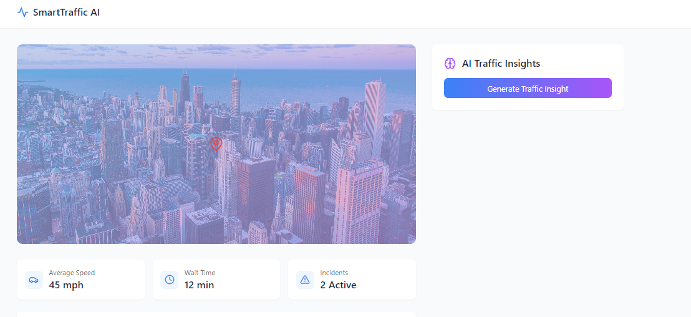

# SmartTraffic AI

SmartTraffic AI is an AI-powered traffic insight tool designed to analyze real-time traffic conditions and provide predictive insights and recommendations. Using advanced generative AI models, it offers users valuable information to navigate traffic congestion, anticipate delays, and choose optimal routes, making urban travel smoother and more efficient.

## Project Overview

The objective of SmartTraffic AI is to leverage AI-driven models to enhance transportation efficiency by providing actionable insights based on real-time traffic patterns. By integrating data such as current traffic congestion, weather conditions, and incidents, SmartTraffic AI delivers brief, informative recommendations aimed at reducing travel time and minimizing congestion.

## Features

- **AI-Powered Traffic Prediction**: Generates predictive insights based on current traffic, weather, and incident reports.
- **Real-Time Recommendations**: Provides actionable suggestions, helping users select the best routes during peak traffic hours.
- **Dynamic Loading Indicators**: A user-friendly interface with responsive loading animations to keep users informed during analysis.
- **Error Handling**: Ensures reliable usage with messages to alert users when insights are unavailable.

## AI Model

SmartTraffic AI is powered by Google’s Generative AI (Gemini model), using a natural language processing approach to generate meaningful insights. This AI model analyzes context provided in prompts to output actionable traffic insights.

## How It Works
SmartTraffic AI’s insights are generated in the following way:

- **Data Collection**: The tool considers predefined traffic conditions such as congestion, weather, and incidents.
- **AI Processing**: Using a prompt fed into Google’s Gemini AI model, the application generates a brief traffic prediction and recommendations.
- **Result Display**: The generated insight is presented to the user through a clean, user-friendly interface.

## Future Development
- **Real-Time Data Integration**: Integrate actual traffic and weather APIs to provide fully dynamic, live traffic insights.
- **User Input Customization**: Allow users to input specific locations, routes, or desired travel times for more tailored insights.
-**Mobile Compatibility**: Develop a mobile version of the app for on-the-go accessibility.
- **Multilingual Support**: Expand language options to make SmartTraffic AI accessible to a wider, global audience.
- **Notification System**: Implement real-time push notifications to alert users of significant changes in traffic conditions on their routes.

## Contributing
Contributions are welcome to improve SmartTraffic AI’s capabilities and user experience. Please follow these steps if you’re interested:

- Fork the repository.
- Create a new branch for your feature or bug fix.
- Commit your changes and open a pull request.

## License
This project is licensed under the MIT License 